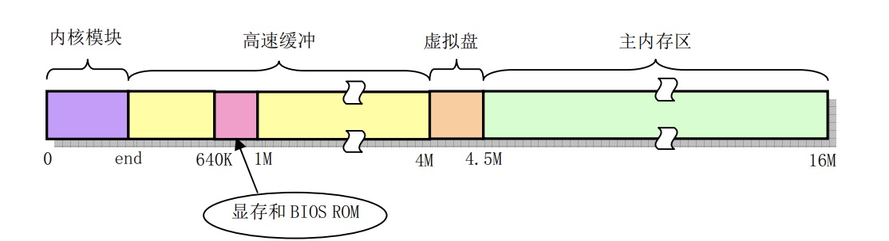
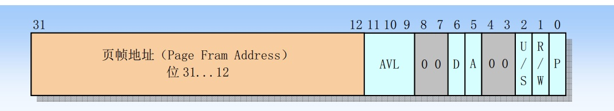
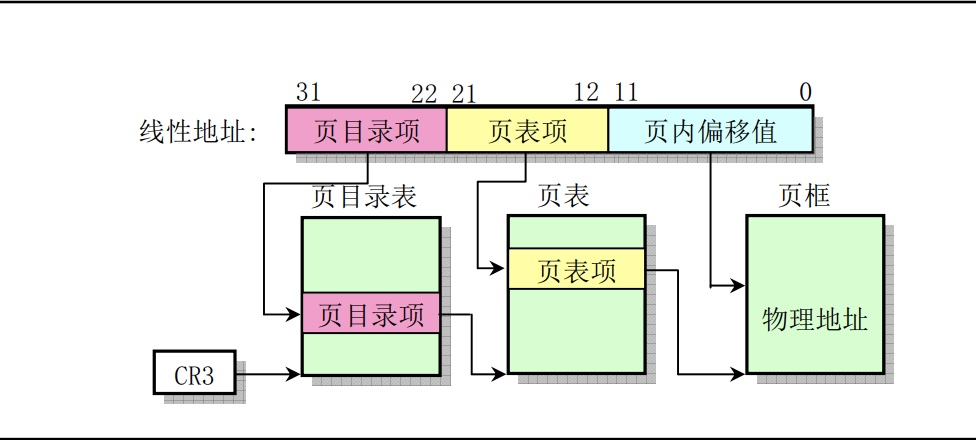

# 内存管理



> 主内存区就是当前的内存管理所管理的模块，如果系统中还存在RAM虚拟盘时，主内存区前段还要扣除虚拟盘所占的内存空间

分页管理方式。利用页目录和页表结构处理对内存的申请和释放操作

## 异常中断

page.s仅包含内存页异常的中断处理过程，对缺页和页写保护的处理


主要分为两种情况处理

- 由于缺页引起的页异常中断，通过调用do_no_page(error_code, address)来处理
- 由写保护引起的页异常，此时调用页写保护处理函数do_wp_page(error_code, address)进程处理

error_code是由CPU自动产生并压入堆栈的，线性地址则是由控制寄存器CR2(专门存放页出错时的线性地址)中取得的

```bash
.globl page_fault # 声明为全局变量，将在traps.c中用于设置页异常描述符

page_fault:
	xchgl %eax,(%esp) # 由于cpu自动将错误码压入栈中，所以这里从esp取出错误码存储到eax中
	pushl %ecx
	pushl %edx
	push %ds
	push %es
	push %fs
	movl $0x10,%edx # 内核数据段选择符
	mov %dx,%ds
	mov %dx,%es
	mov %dx,%fs
	movl %cr2,%edx # 从cr2中取出引起页面异常的线性地址
	pushl %edx # 压入线性地址到栈中(函数第二个参数)
	pushl %eax # 压入错误码(函数第一个参数)
	testl $1,%eax # 测试页是否存在标志P(位0)，如果不是缺页引起的异常则跳转
	jne 1f # 如果是1即写保护异常，进行跳转
	call do_no_page # 缺页处理函数
	jmp 2f
1:	call do_wp_page # 写保护异常
2:	addl $8,%esp # 丢弃压入栈的两个参数，弹出栈中寄存器并退出中断
	pop %fs
	pop %es
	pop %ds
	popl %edx
	popl %ecx
	popl %eax
	iret
```

## 寻址

在0.11版本中，所有进程都是用一个页目录表，而每个进程都有自己的页表。

经过分段处理，内核代码和数据段长度是16MB，使用了4个页表，且直接位于页目录表后面，然后再经过分页机制变换，被直接一一对应的映射到16MB的物理内存上。

为了使用分页机制，一个32位的线性地址被分为三个部分，分别用来指定一个页目录项、一个页表项和对应物理内存页上的偏移地址



- 页框地址：指定一页内存的物理起始地址
- 存在位P: 确定一个页表项是否可以用于地址转换（如果为0且发出地址转换，则会发出缺页中断异常，即当前这个页未使用）
- 已访问A
- 已修改D
- 读/写位
- 用户/超级用户位



一个系统中可以同时存在多个页目录表，而在某个时刻只有一个页目录表可用(由CPU寄存器CR3来确定)

## 写时拷贝

当进程A fork创建出一个子进程B时，B会直接以只读的方式共享进程A的物理页面，只有当A或者B需要执行写操作的时候，会产生int14中断，然后使用do_wp_page来尝试解决这个问题

对产生中断的这个页面取消共享，并且为写进程复制一新的物理页面，然后从异常处理函数中返回，就会重新执行写入操作指令
